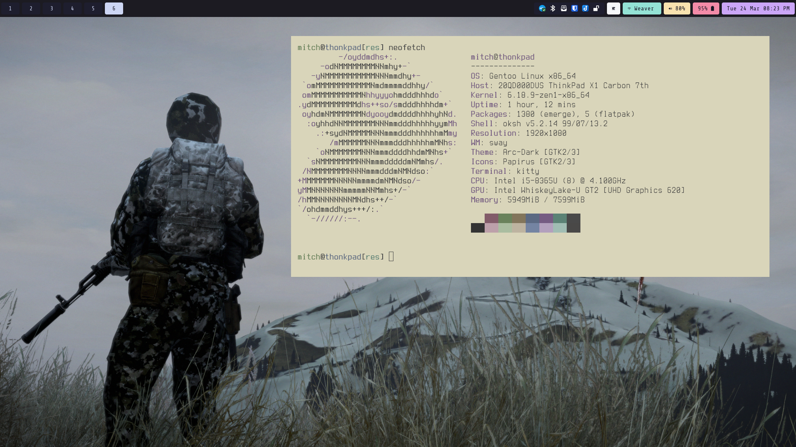

# ⚫ ⚫ ⚫

My personal dotfiles. Buyer beware, its messy.

I've been using *nix for about 15 years  
bouncing between Gentoo, Alpine, and OpenBSD.

## Laptop

current main machine is a Thinkpad X1 Carbon 7th Gen  
looking to replace soon

## See also

* [~/bin](https://github.com/mitchweaver/bin)
* [Gentoo files](https://github.com/mitchweaver/gentoo)
* [color theme](https://github.com/mitchweaver/color-nostalgia)

